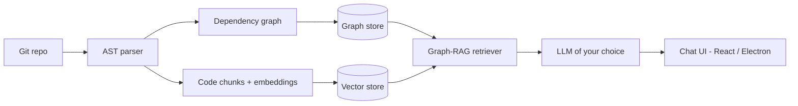

<!-- Header banner -->
<p align="center">
  
</p>

<p align="center">
  
</p>

<p align="center">
  <a href="https://github.com/Arnav-aka-guy"></a>
  <a href="https://github.com/Arnav-aka-guy?tab=followers"></a>
  <a href="https://github.com/Arnav-aka-guy?tab=repositories"></a>
  <a href="https://www.linkedin.com/in/arnav-chaudhary-76141430a/"></a>
  <a href="https://leetcode.com/arnav_chaudhary007"></a>
  
</p>

---

## 🧠 About Me

```python
class Arnav:
    role       = "Aspiring AI/ML Engineer"
    building   = "Repository-scanner-engine"   # codebase intelligence with Graph-RAG
    focus      = ["Machine Learning", "LLM apps", "Automation"]
    stack      = ["Python", "TypeScript", "FastAPI", "React", "Electron"]
    philosophy = "Build AI tools that ship, not just demos"
    fun_fact   = "I play games 🎮"

    def say_hi(self):
        print("Thanks for dropping by! Let's build something cool together.")
```

- 🔭 Currently building **[Repository-scanner-engine](https://github.com/Arnav-aka-guy/Repository-scanner-engine)**, a codebase intelligence platform with AST parsing, dependency graphs, semantic search and Graph-RAG chat
- 📰 Built **[Global-News-](https://github.com/Arnav-aka-guy/Global-News-)**, a news aggregation project
- 🌱 Getting deeper into machine learning and LLM-powered app development
- 💬 Happy to talk about AI tooling, RAG, and developer tools
- 📫 Easiest way to reach me: [LinkedIn](https://www.linkedin.com/in/arnav-chaudhary-76141430a/)

---

## 🎯 Current Focus

<table>
<tr>
<td valign="top" width="50%">

**📚 Learning**
- Deep learning with PyTorch
- Vector databases and embeddings
- Evaluating RAG pipelines
- System design basics

</td>
<td valign="top" width="50%">

**🗺️ Roadmap**
- [x] Ship Global-News- v1
- [x] AST parsing + dependency graphs
- [ ] Graph-RAG chat polish in Repository-scanner-engine
- [ ] Publish a small ML model end to end (train → API → UI)
- [ ] First open source contribution to an ML library

</td>
</tr>
</table>

---

## 🛠️ Tech Stack

**Languages**

<p align="left">
  
</p>

**AI / ML**

<p align="left">
  
  
  
  
</p>

**Frameworks & Tools**

<p align="left">
  
</p>

**Databases & DevOps**

<p align="left">
  
</p>

---

## 🚀 Featured Projects

<p align="center">
  <a href="https://github.com/Arnav-aka-guy/Repository-scanner-engine"></a>
  <a href="https://github.com/Arnav-aka-guy/Global-News-"></a>
</p>

| Project | What it does | Built with |
|---|---|---|
| **[Repository-scanner-engine](https://github.com/Arnav-aka-guy/Repository-scanner-engine)** | Codebase intelligence: AST parsing, dependency graphs, semantic search and Graph-RAG chat, with multi-provider LLM support | FastAPI · React/TypeScript · Electron |
| **[Global-News-](https://github.com/Arnav-aka-guy/Global-News-)** | Pulls together news stories from multiple sources into one place | TypeScript |

<details>
<summary><b>🔍 How Repository-scanner-engine works (click to expand)</b></summary>
<br>



</details>

---

## 📊 GitHub Stats

<p align="center">
  
  
</p>

<p align="center">
  
</p>

<p align="center">
  
</p>

### 🏆 Trophies

<p align="center">
  
</p>

---

## ⚡ Recent Activity

<!--START_SECTION:activity-->
<!--END_SECTION:activity-->

---

## 🐍 Contribution Snake

<p align="center">
  <picture>
    <source media="(prefers-color-scheme: dark)" srcset="https://raw.githubusercontent.com/Arnav-aka-guy/Arnav-aka-guy/output/github-snake-dark.svg" />
    <source media="(prefers-color-scheme: light)" srcset="https://raw.githubusercontent.com/Arnav-aka-guy/Arnav-aka-guy/output/github-snake.svg" />
    
  </picture>
</p>

---

## 💭 Dev Quote of the Day

<p align="center">
  
</p>

---

## 🔗 Connect With Me

<p align="left">
  <a href="https://www.linkedin.com/in/arnav-chaudhary-76141430a/"></a>
  <a href="https://instagram.com/arnav.chaudhary_007"></a>
  <a href="https://leetcode.com/arnav_chaudhary007"></a>
</p>

<p align="center">
  <i>⭐ If you like any of my projects, a star goes a long way. Thanks for visiting!</i>
</p>

<p align="center">
  
</p>
